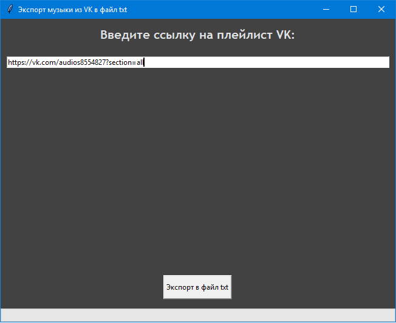

# Экспорт списка песен из плейлиста vk.ru в фаил .txt при помощи Selenium и Python
## Содержание проекта
### browser.py
Фаил содержит класс Browser, который описывает экземпляр браузера и имеет следующие функции:

- ***__init__*** — конструктор класса.

- ***open*** — открывает веб-страницу в браузере.

- ***scroll_element_to_bottom*** — пролистывает страницу до самого низа.
- ***is_element_present*** — если элемент с определенным селектором найдет то возвращает True, иначе False. Также обрабатывает исключение **NoSuchElementException**
- ***find_element_is_present*** — если элемент с определенным селектором найдет то возвращает сам элемент веб-страницы, иначе False. Также обрабатывает исключение **NoSuchElementException**
- ***find_elements_is_present*** — если элементы с определенным селектором найдены то возвращает эти элементы веб-страницы, иначе False. Также обрабатывает исключение **NoSuchElementException**

### vk_page.py
Фаил содержит селекторы страницы с плейлистом vk.ru, класс VKPage.
класс VkPage содержит методы по работе с плейлистом vk.ru:
- ***check_music_page*** — проверят наличия блока с музыкой по селектору AUDIO_LIST_BLOCK.

  Этот метод позволяет проверил вставил ли пользователь ссылку именно на плейлист с музыкой вк или нет.
- ***get_song_block*** — получает все блоки с песнями в плейлисте.
- ***create_music_list_from_vk_music_page*** — создает список песен в формате "Название песни - Название группы" и записывает его в фаил .txt.
- ***scroll_audio_block_vk_page_to_bottom*** — пролистывает страницу до самого низа, позволяя прогрузить всю музыку в текущем плейлисте. Это необходимо для плейлистов в которых содержиться более 100 песен.
### window.py
Фаил содержит класс VKMusicExporter, который описывает GUI программы. Использует бибилиотеку tkinter.
Содержит следующие функции:
- ***__init__*** — конструктор класса. Содержит описание элементов интерфеса, таких как: текст, поле ввода, кнопка, статус бар.
- ***export_music*** — экспортирует список плейлиста в .txt. Отвечает за события нажатие кнопки "Экпорт в файл .txt".
- ***create_window*** — вызывает окно программы.
### main.py
Фаил содержит конструкцию для запуска программы и метод вызова окна create_window().
```
from window import create_window

if __name__ == '__main__':
    create_window()
```
## Интерфейс (GUI)

